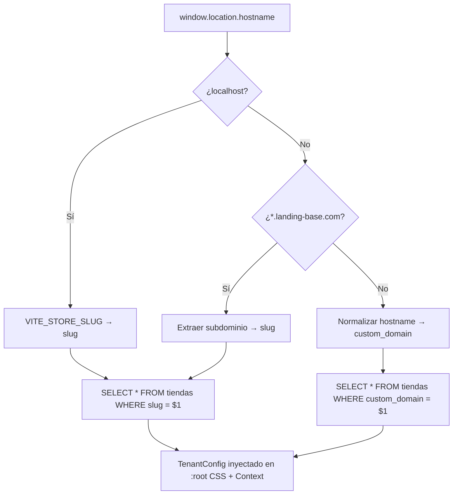
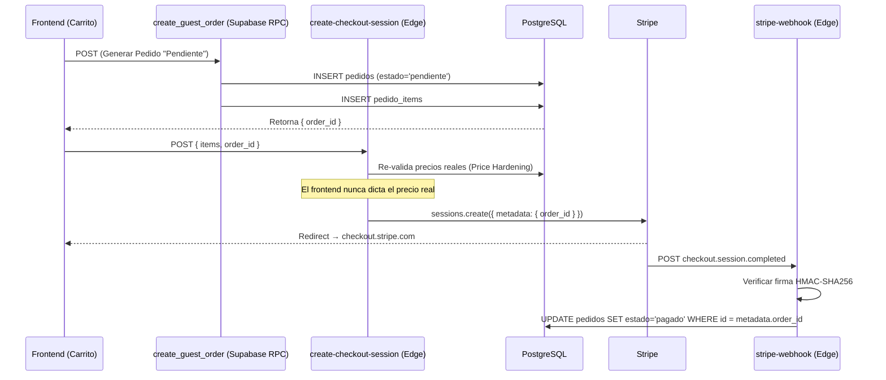
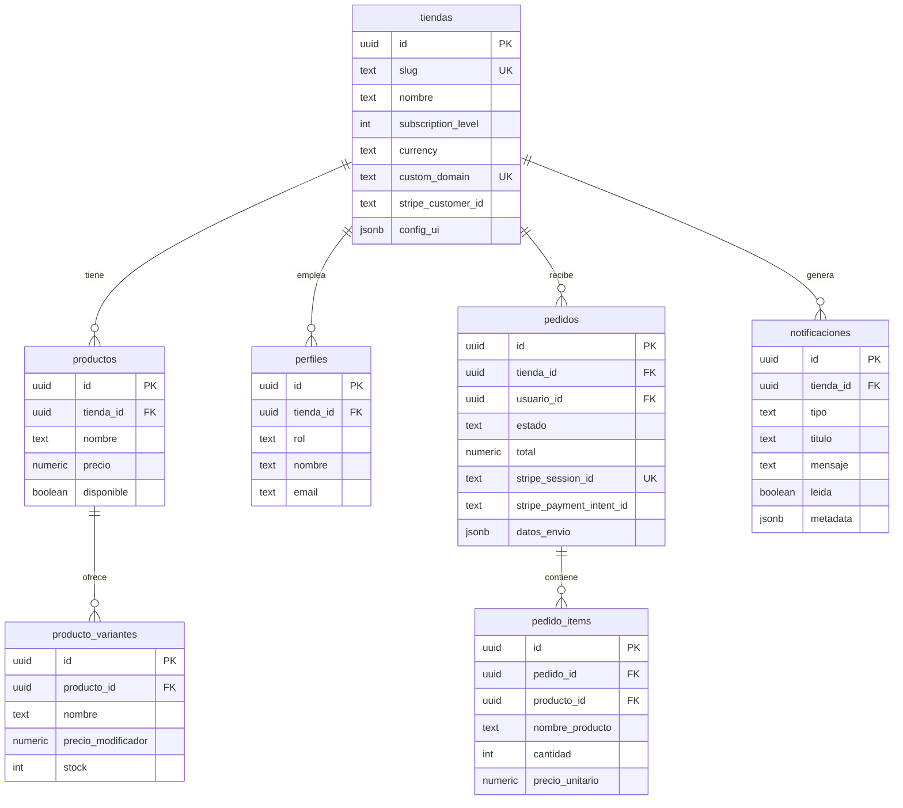

<div align="center">

# 🌸 Landing-Base

### Plataforma SaaS Multi-Tenant para Negocios Locales


**Solución turnkey que transforma cualquier negocio local en un e-commerce profesional en minutos.**
Una base de código. Infinitos tenants. Tres niveles de monetización.

[Arquitectura](#-arquitectura-tecnológica) · [Seguridad](#-seguridad--core-logic-deep-dive) · [Base de Datos](#-esquema-de-base-de-datos) · [Inicio Rápido](#-guía-de-inicio-rápido) · [Roadmap](#-roadmap-de-desarrollo)

</div>

---

## 🎯 Propuesta de Valor y Modelo de Negocio

Landing-Base es una **plataforma SaaS (Software as a Service)** diseñada para que negocios locales — con foco inicial en **florerías** — tengan presencia digital profesional sin necesidad de conocimientos técnicos. Un solo despliegue sirve a múltiples clientes (tiendas) de forma aislada y segura.

### El Problema

Los negocios locales necesitan vender en línea, pero las soluciones existentes son genéricas, costosas, o requieren un equipo de desarrollo dedicado. Un dueño de florería no debería necesitar entender Stripe, SSL, o PostgreSQL para recibir pagos con tarjeta.

### La Solución

Una plataforma **Netflix-style**: el dueño se registra, elige su plan, personaliza su tienda desde un panel visual, y empieza a vender. Todo el backend, pagos, seguridad y logística están resueltos.

### 💎 Modelo de 3 Niveles de Suscripción

El modelo de monetización se basa en **feature gating progresivo** controlado por la columna `tiendas.subscription_level`:

| | Nivel 1 — **Básico** | Nivel 2 — **Profesional** | Nivel 3 — **Premium** |
|---|---|---|---|
| **Landing Page** | ✅ Personalizable | ✅ Personalizable | ✅ Personalizable |
| **Catálogo** | ✅ Productos + Variantes | ✅ Productos + Variantes | ✅ Productos + Variantes |
| **Panel Admin** | ✅ Dashboard + KPIs | ✅ Dashboard + KPIs | ✅ Dashboard + KPIs |
| **Gestión Pedidos** | ✅ Timeline completo | ✅ Timeline completo | ✅ Timeline completo |
| **Ventas** | 📱 WhatsApp | 💳 Stripe Checkout | 💳 Stripe Checkout |
| **Cuentas Cliente** | ❌ | ✅ Login + Historial | ✅ Login + Historial |
| **Notificaciones RT** | ❌ | ✅ Realtime al Dashboard | ✅ Realtime al Dashboard |
| **Dominio Custom** | ❌ | ❌ | ✅ `www.mifloreria.com` |
| **Logística** | ❌ | ❌ | ✅ App Repartidores + GPS |

El gating se implementa con el componente declarativo `<FeatureGate>`:

```tsx
<FeatureGate requiredLevel={2} fallback={<UpgradeBanner />}>
  <StripePaymentButton />
</FeatureGate>
```

---

## 🏗 Arquitectura Tecnológica

### Stack Completo

```
┌─────────────────────────────────────────────────────────────────┐
│                        FRONTEND                                 │
│  React 18 · Vite 6 · Tailwind CSS v4 · Framer Motion           │
│  Zustand (Cart) · Context API (Auth + Tenant) · Lucide Icons   │
├─────────────────────────────────────────────────────────────────┤
│                     EDGE COMPUTING                              │
│  Supabase Edge Functions (Deno Deploy)                          │
│  ┌──────────────────────┐  ┌──────────────────────────────┐    │
│  │ create-checkout-     │  │ stripe-webhook               │    │
│  │ session              │  │ (Zero-Trust / verify_jwt=off)│    │
│  │ (Price Hardening)    │  │ (HMAC-SHA256 Verification)   │    │
│  └──────────────────────┘  └──────────────────────────────┘    │
├─────────────────────────────────────────────────────────────────┤
│                     BACKEND (BaaS)                              │
│  Supabase · PostgreSQL 17 · Row Level Security (RLS)            │
│  Auth (JWT + RBAC) · Realtime (WebSocket) · Storage (S3)        │
├─────────────────────────────────────────────────────────────────┤
│                       PAGOS                                     │
│  Stripe Checkout (Hosted) · Webhook Asíncrono                   │
│  Flujo: Frontend → Edge Function → Stripe → Webhook → DB       │
└─────────────────────────────────────────────────────────────────┘
```

### Resolución Multi-Tenant (Dominios)

El `TenantContext` resuelve la identidad de la tienda dinámicamente según el hostname:



### Estructura del Proyecto

```
Landing-Base/
├── src/
│   ├── components/
│   │   ├── FeatureGate.tsx          # Control de acceso por nivel SaaS
│   │   ├── auth/                    # RoleProtectedRoute, LoginForm
│   │   ├── sections/                # Hero, Catálogo, Testimonios...
│   │   └── ui/                      # Componentes reutilizables
│   ├── context/
│   │   ├── TenantContext.tsx         # Resolución multi-tenant + temas CSS
│   │   └── AuthContext.tsx           # Sesión + perfil + RBAC
│   ├── store/
│   │   └── cartStore.ts             # Zustand — carrito con variantes
│   ├── services/
│   │   └── orderService.ts          # RPC a create_guest_order
│   ├── layouts/
│   │   └── AdminLayout.tsx          # Shell del dashboard admin
│   ├── pages/
│   │   ├── admin/                   # Dashboard, Pedidos, Catálogo, Equipo, Config
│   │   ├── auth/                    # LoginPage
│   │   ├── public/                  # StorefrontPage (landing)
│   │   └── storefront/              # CustomerAccountPage
│   ├── lib/
│   │   └── supabaseClient.js        # Singleton del cliente Supabase
│   ├── types.ts                     # Contratos TypeScript del dominio
│   └── main.jsx                     # Enrutamiento principal + Providers
├── supabase/
│   ├── functions/
│   │   ├── _shared/cors.ts          # Headers CORS compartidos
│   │   ├── create-checkout-session/ # Price Hardening + Stripe Session
│   │   ├── stripe-webhook/          # Zero-Trust + Idempotencia
│   │   ├── sync-instagram/          # Cache de feed IG
│   │   └── procesar-venta-legacy/   # Legacy (WhatsApp flow)
│   ├── migrations/                  # DDL + RLS policies
│   ├── config.toml                  # Edge Functions config
│   └── schema.sql                   # RLS para catálogo público
└── package.json
```

### Mapa de Rutas

| Ruta | Componente | Protección | Nivel |
|---|---|---|---|
| `/` | `StorefrontPage` | Pública | 1+ |
| `/login` | `LoginPage` | Pública | 1+ |
| `/mi-cuenta` | `CustomerAccountPage` | `RoleProtectedRoute` → `cliente` | 2+ |
| `/admin` | `AdminDashboardPage` | `RoleProtectedRoute` → `dueño, empleado, superadmin` | 1+ |
| `/admin/pedidos` | `AdminPedidos` | RBAC | 1+ |
| `/admin/catalogo` | `AdminProductos` | RBAC | 1+ |
| `/admin/equipo` | `AdminEquipo` | RBAC | 1+ |
| `/admin/ajustes` | `AdminConfiguracion` | RBAC | 1+ |

---

## 🔒 Seguridad & Core Logic (Deep Dive)

### 1. Protocolo Zero-Trust en Edge Functions

Las Edge Functions operan bajo el principio de **"nunca confíes, siempre verifica"**:

| Función | Autenticación | Razón |
|---|---|---|
| `create-checkout-session` | JWT (`verify_jwt = true`) | Invocada por el navegador del usuario |
| `stripe-webhook` | HMAC-SHA256 (`verify_jwt = false`) | Invocada server-to-server por Stripe |

El webhook **no puede usar JWT** porque Stripe no envía tokens de sesión. En su lugar, cada evento viene firmado criptográficamente con HMAC-SHA256 usando el `STRIPE_WEBHOOK_SECRET`. La validación se realiza con `stripe.webhooks.constructEvent()` sobre el body **en texto plano** (nunca JSON parseado, porque la re-serialización invalida la firma).

### 2. Price Hardening y Patrón "Order-First" (Transacciones Atómicas)

El sistema de pagos de Landing-Base utiliza un patrón **Order-First** para garantizar trazabilidad absoluta y evitar la pérdida de pedidos pagados (race conditions) o el descarte de clientes en Guest Checkout.



**Ventajas del patrón Order-First:**
* **Recuperación de Carritos:** Si el cliente cierra Stripe sin pagar, el pedido queda registrado como "pendiente" para futuras estrategias de remarketing.
* **Seguridad (Price Hardening):** El backend extrae los precios directamente de la base de datos para la pasarela de pagos.
* **Idempotencia Transaccional:** El Webhook actualiza un pedido existente mediante su UUID en lugar de crear uno nuevo de cero, eliminando problemas de duplicidad o pérdida de metadata de envío si Stripe falla momentáneamente.

### 3. Idempotencia Dual en el Webhook

Stripe puede reintentar un webhook hasta 3 veces (backoff: 5min → 30min → 2hrs). Sin idempotencia, cada reintento podría causar estragos.
Al utilizar el patrón `Order-First`, el webhook se convierte en una operación idempotente por naturaleza (un `UPDATE` que cambia el estado a 'pagado' múltiples veces no tiene efectos secundarios adicionales, además de proteger notificaciones con checks previos).

### 4. Sistema de Diseño: Premium Glassmorphism UI

Toda la plataforma — desde el Storefront hasta el Superadmin — se rige bajo un sistema de diseño unificado, moderno e inmersivo:
* **Glassmorphism Dinámico:** Uso extensivo de variables CSS (`--color-background-primary`, `bg-white/20`, `backdrop-blur-xl`) para interfaces táctiles sin bordes sólidos.
* **Compactación y Zero-Scroll:** Flujos de autenticación mediante pestañas deslizantes interactivas (*Segmented Controls*) para una experiencia App-like.
* **Scrollbars y Detalles Elevados:** CSS personalizado a nivel webkit para asegurar un diseño inmersivo y responsivo al 100% en todas las vistas del panel de administración.

### 5. RBAC (Role-Based Access Control)

| Rol | Acceso | Capacidad |
|---|---|---|
| `superadmin` | `/superadmin/*` | Gestión global del SaaS, suscripciones (MRR) y tenants |
| `dueño` | `/admin/*` | Admin total de su tienda. Métricas, configuración y equipo (excepto escalar roles a superadmins) |
| `empleado` | `/admin/*` | Pedidos y catálogo, sin acceso a configuración crítica |
| `repartidor` | App dedicada | Entregas asignadas + GPS (Nivel 3) |
| `cliente` | `/mi-cuenta` | Historial de pedidos y tracking (Nivel 2+) |

---

## 🗄 Esquema de Base de Datos

### Tablas Principales y Relaciones



### Row Level Security (RLS)

Todas las tablas tienen RLS habilitado. El aislamiento multi-tenant es **enforced a nivel de base de datos**, no en la aplicación:

| Tabla | Política | Descripción |
|---|---|---|
| `tiendas` | `anon_read` | Lectura pública (resolver slug → id) |
| `productos` | `anon_read` | Solo productos con `disponible = true` |
| `pedidos` | `staff_read` | Staff solo ve pedidos de su `tienda_id` |
| `pedidos` | `owner_update` | Solo dueños actualizan estado |
| `pedido_items` | `staff_read` | Acceso vía JOIN con pedidos de su tienda |
| `notificaciones` | `staff_read/update` | Staff lee y marca como leídas |

> **Nota:** Los INSERT de `pedidos`, `pedido_items` y `notificaciones` son ejecutados exclusivamente por el webhook usando **Service Role Key**, que bypassa RLS.

---

## 🚀 Guía de Inicio Rápido

### Prerrequisitos

- Node.js 18+
- [Supabase CLI](https://supabase.com/docs/guides/cli) v2.98+
- Cuenta de [Stripe](https://dashboard.stripe.com) (modo test)

### 1. Instalación

```bash
git clone https://github.com/tu-org/Landing-Base.git
cd Landing-Base
npm install
```

### 2. Variables de Entorno (Frontend)

```bash
cp .env.example .env
```

```env
# Supabase
VITE_SUPABASE_URL=https://tu-proyecto.supabase.co
VITE_SUPABASE_ANON_KEY=eyJ...tu-clave-anon

# Desarrollo Multi-tenant (slug de la tienda a simular)
VITE_STORE_SLUG=flores-del-corazon
```

> ⚠️ **Las claves secretas NUNCA van en `.env`.** Se configuran como Supabase Secrets.

### 3. Secretos del Servidor (Edge Functions)

```bash
# Stripe
supabase secrets set STRIPE_SECRET_KEY=sk_test_xxx
supabase secrets set STRIPE_WEBHOOK_SECRET=whsec_xxx
```

### 4. Ejecutar en Desarrollo

```bash
# Frontend (Vite dev server)
npm run dev

# Edge Functions (en otra terminal)
supabase functions serve
```

### 5. Desplegar Edge Functions

```bash
# Checkout — requiere JWT del usuario
supabase functions deploy create-checkout-session

# Webhook — NO requiere JWT (firma criptográfica de Stripe)
supabase functions deploy stripe-webhook --no-verify-jwt
```

### 6. Configurar Webhook en Stripe

1. Ir a [Stripe Dashboard → Developers → Webhooks](https://dashboard.stripe.com/webhooks)
2. Crear endpoint: `https://tu-proyecto.supabase.co/functions/v1/stripe-webhook`
3. Seleccionar evento: `checkout.session.completed`
4. Copiar el **Signing Secret** (`whsec_...`) y guardarlo:
   ```bash
   supabase secrets set STRIPE_WEBHOOK_SECRET=whsec_xxx
   ```

### 7. Verificar

```bash
# Testear webhook con Stripe CLI
stripe trigger checkout.session.completed

# Ver logs
supabase functions logs stripe-webhook
```

---

## 🗺 Roadmap de Desarrollo

### ✅ Completado

| Milestone | Componentes |
|---|---|
| **Landing Multi-tenant** | `TenantContext`, resolución slug/subdominio/custom_domain, temas CSS dinámicos |
| **Catálogo con Variantes** | `AdminProductos`, CRUD productos + variantes, imágenes Storage |
| **Panel Admin Completo** | Dashboard KPIs, Pedidos (timeline), Equipo, Store Builder |
| **Auth + RBAC** | `AuthContext`, `RoleProtectedRoute`, login universal, 5 roles |
| **Feature Gating SaaS** | `FeatureGate` declarativo, 3 niveles de suscripción |
| **Carrito con Zustand** | `cartStore`, merge de duplicados, selectores derivados |
| **Pagos Stripe (Nivel 2)** | `create-checkout-session` con Price Hardening |
| **Webhook Zero-Trust** | `stripe-webhook` con firma HMAC, idempotencia dual, notificaciones |
| **Notificaciones Realtime** | INSERT en `notificaciones` → Supabase Realtime → Dashboard |
| **Animaciones Premium** | Framer Motion: scroll-reveal, layout transitions, stagger |
| **Superadmin: Suscripciones**| Panel en `/superadmin/suscripciones` para gestionar MRR y tenants |
| **UX & Seguridad** | Dark Mode nativo (Tailwind v4), Logout por inactividad (15 min) |
| **Fixes Críticos** | Sincronización de Webhook con `cliente_id` e integridad visual de Pedidos |

### 🔧 En Progreso

| Feature | Detalle |
|---|---|
| **Guest Checkout Completo** | Flujo de compra sin login con datos de envío |
| **Conexión Pedidos Live** | Reemplazar mock data en `AdminPedidos` con queries Supabase |
| **Notificaciones en Dashboard** | Bell icon con badge + panel desplegable Realtime |

### 🔮 Próximos Hitos

| Feature | Nivel | Prioridad |
|---|---|---|
| **Onboarding Self-Service** | — | 🔴 Alta |
| **Stripe Connect (Split Payments)** | 2 | 🟡 Media |
| **App de Repartidores** | 3 | 🟡 Media |
| **Tracking GPS en Tiempo Real** | 3 | 🟡 Media |
| **Analíticas Avanzadas** | 3 | 🟢 Baja |
| **Internacionalización (i18n)** | — | 🟢 Baja |

---

## 📄 Licencia

Proyecto propietario. Todos los derechos reservados.

---

<div align="center">

Arquitectura diseñada por el equipo de ingeniería de **Landing-Base**.

*Built with 🌸 for local businesses that deserve world-class technology.*

</div>

